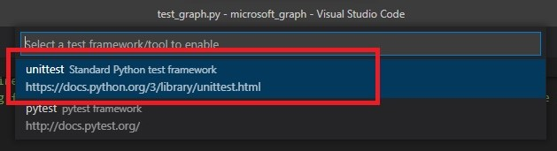
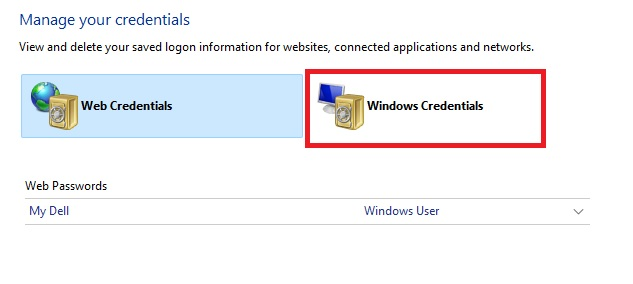

#   Welcome to the graph_api tutorial code of the [whatever piques my interest youtube channel](https://www.youtube.com/channel/UCgoux3jJpq1EDknYbkzfvuw)

## If you find this repository useful, please give it a star ⭐.

This tutorial has the objective of helping users connect to the Microsoft graph API email activities, without using user sign in (application daemon), and restricting access to certain mailboxes.

This tutorial can be broken down in two parts. 

1.  Application creation and permission provisioning within the office365 environment.
You can follow the [Register an app to access Office365](./Register%20an%20app%20to%20access%20Office365.pdf) document or you can watch the video tutorial.

2.  Utilizing [MSAL](https://learn.microsoft.com/en-us/azure/active-directory/develop/msal-overview) and the [Microsoft GraphAPI](https://learn.microsoft.com/en-us/graph/use-the-api) in python to preform diverse activities with emails in an application daemon scenario

To find the scenario that best suits your needs check the following [MSAL scenarios](https://msal-python.readthedocs.io/en/latest/)

To understand how to utilize the graph API look for the service that your interested in and read how to call the specific endpoint.

Graph API [sendMail](https://learn.microsoft.com/en-us/graph/api/user-sendmail?view=graph-rest-1.0&tabs=http) for example 

##  What to do to start using this project?

This are only recommendations so feel free to skip steps if you feal like it.

1.  Creat an office365 aplication following the [Register an app](./Register%20an%20app%20to%20access%20Office365.pdf) instructions

2.  Open the project in visual studio code in the “./graph_tutorial/microsoft_graph” directory

3.  Set up a virtual environment by runing `python -m venv ./testEnv` for example and select the virtual environment interpret within visual studio code.  

    

4. Install the [requirements.txt](./microsoft_graph/requirements.txt) by runing the command `pip install -r .\requirements.txt`

5. Run the test set to understand how to use the application
    
    Select the test tab, click configure tests

    
    
    
    Select unittest and select graph_utils

    
    

    Enter the pattern in the screen shot
    
    

    ### Now the tests are ready to be runed, but fist we must fill the test with our relevant information

    1.  Create a generic windows credential to securely store the application secret you created by following the [register an app](./Register%20an%20app%20to%20access%20Office365.pdf) document.

        Open the windows credential manager app

        

        Go to windows credentials

        

        Click on add a generic credential

        

        Enter the relevant information. 

        The first field Internet. Is the name that we will use to access the credential.
        
        Username is not relevant for our use case.
        
        Password is where we must enter our app credential secret  
        

        Now fill all the relevant information in the reference file. [test_graph.py](./microsoft_graph/graph_utils/test/test_graph.py)

        

        Remember to also change the email address of the same test file, to the ones you have configured

        

        Once your familiarized with the api by using the test you can install the package by running a `pip install /graph_tutorial/microsoft_graph/packages/microsoft_graph_whatever-1.0.1.tar.gz`
